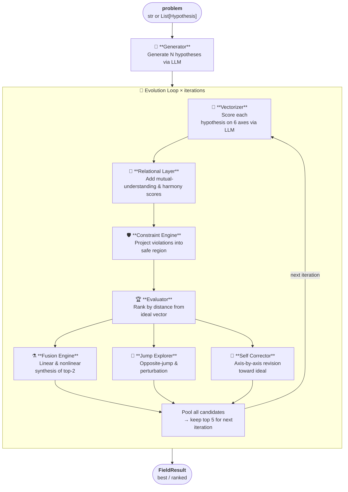

# Axis-HFE — Hypothesis Field Engine

[](https://pypi.org/project/axis-hfe/)
[](https://doi.org/10.5281/zenodo.19645298)

> **"From selecting an answer, to creating one."**

Hypothesis Field Engine (HFE) is a Python library that transforms AI reasoning from single-answer generation into **multi-dimensional hypothesis space exploration**.

Rather than returning the statistically most likely answer, HFE deploys multiple hypotheses simultaneously across a field, evaluates them on a 6-dimensional vector, and converges on the optimal solution through nonlinear synthesis, leap exploration, and self-correction loops.

**Designed by Da-P (Da-P-AIP) — Part of the Cogito Project**

---

## What makes it different

| Conventional LLM | Hypothesis Field Engine |
|---|---|
| Selects one answer by max probability | Deploys multiple hypotheses across a field |
| Answer is selected, not created | New answers emerge through vector synthesis |
| Evaluation axes are implicit | Explicit 6-dimensional vector scoring |
| No constraint management | Hard & soft constraints ensure safety |
| Converges in one pass | Hypotheses evolve across multiple generations |
| No relational evaluation | Relational Layer scores mutual harmony |

---

## How it works

### Processing pipeline

Each call to `engine.run()` executes the following pipeline, repeated for `iterations` cycles:



### What each component does

| Component | Role |
|---|---|
| **Generator** | Asks the LLM to produce N structurally different hypotheses in one call, each pre-scored on the 6D vector |
| **Vectorizer** | Re-evaluates hypotheses whose vector is all-zero (fused / jumped hypotheses) |
| **Relational Layer** | Adds a score for mutual understanding, alignment, respect, and harmony — ensuring the best hypothesis is also *considerate* |
| **Constraint Engine** | Hard-clips `risk > 0.40`, `feasibility < 0.60`, `consistency < 0.70` to keep all candidates in a safe operating region |
| **Evaluator** | Computes weighted Euclidean distance from the ideal vector; lower distance = higher score |
| **Fusion Engine** | Creates new hypotheses by linearly and nonlinearly blending the top-2 vectors — the result can exceed both parents |
| **Jump Explorer** | Generates a hypothesis that moves *away* from the worst candidate and *toward* the best, plus small random perturbations |
| **Self Corrector** | Nudges each top-3 hypothesis closer to the ideal on every axis independently |

### Score evolution across iterations

```
iter 0  ──  raw LLM output          [0.90 – 1.00]
iter 1  ──  fusion + self-correct   [1.05 – 1.10]  ↑ synthesis kicks in
iter 2  ──  leap exploration added  [1.12 – 1.16]  ↑ divergent candidates
iter 3  ──  convergence             [1.16 – 1.18]  ↑ optimal synthesis
```

> Scores above 1.0 are possible because the weighted distance formula rewards hypotheses that **exceed** the ideal on high-weight axes (accuracy, feasibility).

---

## Install

```bash
# Ollama (local, free — no extra install needed)
pip install axis-hfe

# OpenAI (ChatGPT / GPT-4o)
pip install axis-hfe[openai]

# Anthropic (Claude)
pip install axis-hfe[anthropic]

# All providers
pip install axis-hfe[all]
```

**Core dependencies**: Python 3.11+, httpx, pydantic

---

## Quickstart by provider

### Ollama (local, free)

```python
import asyncio
from hypothesis_field import HypothesisFieldEngine, EngineConfig

config = EngineConfig(
    provider="ollama",
    model="gemma4:e4b",
    ideal_preset="default",
    iterations=3,
)
engine = HypothesisFieldEngine(config)
result = asyncio.run(engine.run("Your problem here"))

print(result.best.content)   # best hypothesis
print(result.best.score)     # score
print(result.best.vector)    # 6D vector
```

### OpenAI (ChatGPT / GPT-4o)

```bash
pip install axis-hfe[openai]
export OPENAI_API_KEY="sk-..."
```

```python
config = EngineConfig(
    provider="openai",
    model="gpt-4o",
    ideal_preset="creative",
)
engine = HypothesisFieldEngine(config)
result = asyncio.run(engine.run("Your problem here"))
```

### Anthropic (Claude)

```bash
pip install axis-hfe[anthropic]
export ANTHROPIC_API_KEY="sk-ant-..."
```

```python
config = EngineConfig(
    provider="anthropic",
    model="claude-sonnet-4-6",
    ideal_preset="balanced",
)
engine = HypothesisFieldEngine(config)
result = asyncio.run(engine.run("Your problem here"))
```

### Without LLM (testing / offline)

```python
config = EngineConfig(mock_llm=True)
engine = HypothesisFieldEngine(config)
result = asyncio.run(engine.run("Test problem"))
```

---

## EngineConfig options

| Parameter | Type | Default | Description |
|---|---|---|---|
| `provider` | str | `"ollama"` | `"ollama"` / `"openai"` / `"anthropic"` |
| `model` | str\|None | None (auto) | Model name — None selects provider default |
| `api_key` | str\|None | None | API key — None reads from environment variable |
| `ollama_base_url` | str | `http://localhost:11434` | Ollama server URL |
| `ideal_preset` | str | `"default"` | Ideal vector preset |
| `iterations` | int | `3` | Evolution loop count |
| `hypothesis_count` | int | `3` | Initial hypothesis count |
| `mock_llm` | bool | `False` | True enables fallback mode (no LLM needed) |
| `custom_ideal` | dict | None | Custom ideal vector |
| `custom_weights` | dict | None | Custom weight vector |

### Default model per provider

| provider | default model |
|---|---|
| `ollama` | `gemma4:e4b` |
| `openai` | `gpt-4o` |
| `anthropic` | `claude-sonnet-4-6` |

---

## Ideal vector presets

| Preset | Character | Best for |
|---|---|---|
| `default` | Balanced | General purpose |
| `creative` | High novelty & divergence | Brainstorming, idea generation |
| `safe` | High accuracy & consistency | Risk management, medical, legal |
| `balanced` | All-axis balance | Decision support |

---

## 6-dimensional evaluation vector

| Axis | Meaning | Ideal (default) |
|---|---|---|
| `accuracy` | Validity and correctness | 0.95 |
| `consistency` | Internal coherence | 0.90 |
| `risk` | Danger of failure / side effects (lower is better) | 0.20 |
| `novelty` | Originality and uniqueness | 0.60 |
| `feasibility` | Practicality | 0.90 |
| `divergence` | Breadth of perspective | 0.45 |

---

## Benchmark results

Tested on multiple complex problem domains using `gemma4:e4b` via Ollama, `iterations=3`, `preset=creative`.

### Score progression across iterations

| Stage | Score range | Notes |
|---|---|---|
| Initial generation (iter 0) | 0.90 — 1.00 | Raw LLM output, 3 hypotheses |
| After iter 1 | 1.05 — 1.10 | Fusion + self-correction applied |
| After iter 2 | 1.12 — 1.16 | Leap exploration adds divergent candidates |
| After iter 3 | 1.16 — 1.18 | Convergence toward optimal synthesis |

### What the synthesis mechanism produced

In a business domain test, the initial generation produced **3 structurally different hypotheses** — one optimizing for stability (novelty=0.40, feasibility=0.90), one for radical innovation (novelty=0.95, feasibility=0.55), and one for emotional value (novelty=0.70, feasibility=0.85).

After 3 evolution loops, the best-ranked hypothesis was **none of the original three** — it was a nonlinear synthesis that combined the strengths of all three while introducing a pricing model innovation that appeared in none of the individual inputs.

> The engine did not select the best idea. It created one that did not exist before.

This emergent behavior — where synthesis produces answers outside the initial hypothesis space — is the core design goal of HFE.

---

## Security

HFE takes the following measures to mitigate security risks when the library is embedded in applications.

### Prompt Injection mitigation

User-supplied `problem` strings are:

1. **Sanitized** — control characters (except tab/newline) are stripped; length is capped at **8,000 characters**.
2. **Delimited** — wrapped in `<<<BEGIN_PROBLEM>>> … <<<END_PROBLEM>>>` markers so the LLM can distinguish user data from instructions.
3. **Role-separated** — generation and evaluation instructions are passed as a **system message**, while the user input is sent as a **user message** (supported by all three providers).

### SSRF mitigation

`ollama_base_url` is validated before any HTTP request is made:

- Only `http://` and `https://` schemes are accepted.
- Known cloud metadata endpoints are blocked (`169.254.169.254`, `metadata.google.internal`, `100.100.100.200`, etc.).

### Resource / DoS limits

`EngineConfig` enforces hard upper bounds at construction time:

| Parameter | Limit |
|---|---|
| `iterations` | 1 — 10 |
| `hypothesis_count` | 1 — 20 |
| `problem` length | 8,000 chars |
| `content` (LLM output) | 2,000 chars |

### API key handling

`OpenAIClient` and `AnthropicClient` raise `ValueError` immediately at construction if no API key is found (argument or environment variable). This prevents silent failures deep in the call stack.

### Output sanitization

Hypothesis `content` returned by the LLM is sanitized (control characters stripped, length capped) before being stored in `Hypothesis.content`. If your application renders this value in HTML, apply HTML-escaping at the presentation layer.

### Log safety

Exception messages in `logger.debug` calls are truncated to 200 characters and scanned for API-key patterns (`sk-*`, `sk-ant-*`), which are replaced with `sk-***MASKED***` before being written to logs.

### Dependency pinning

Core and optional dependencies are pinned with both lower and upper version bounds to prevent unexpected pulls of future breaking or vulnerable releases.

### Recommendations for production use

- Set API keys via **environment variables** (`OPENAI_API_KEY`, `ANTHROPIC_API_KEY`), not hard-coded strings.
- Do **not** expose `ollama_base_url` as a user-facing input without additional validation.
- If hypothesis `content` is rendered in a browser, apply HTML-escaping — HFE sanitizes control characters but does not HTML-escape.
- Use `mock_llm=True` in test environments to avoid making real API calls.

---

## Design philosophy

HFE's reasoning loop includes, alongside technical evaluation axes (accuracy, novelty, feasibility), a **Relational Layer** — scoring mutual understanding, alignment, respect, and harmony.

This reflects the belief that AI reasoning should not only produce *correct* answers, but answers shaped by **mutual consideration** — awareness of relationships, long-term stability, and non-exploitative design.

A great hypothesis is not only logically sound. It is one that holds harmony with the people involved.

---

*このライブラリは Cogito Project の推論コアを独立モジュールとして公開したものです。*
*Cogito 本体の設計・哲学については非公開ですが、*
***AIが「考える」だけでなく「思いやる」必要があるという信念はこのコードに宿っています。***

*This library is the reasoning core of the Cogito Project, released as a standalone module.*
*The full Cogito architecture remains private — but the belief that AI must not only think, but also care, is embedded in this code.*

---

## Relationship to Cogito Project

Axis-HFE is the reasoning core of CogitoV10 (Da-P-AIP), extracted as a standalone package.
The core of CogitoV10 — CausalMemory, the Chorus system, and related architecture — is not included in this package.

---

## License

MIT License — Copyright (c) 2026 Da-P (Da-P-AIP)
